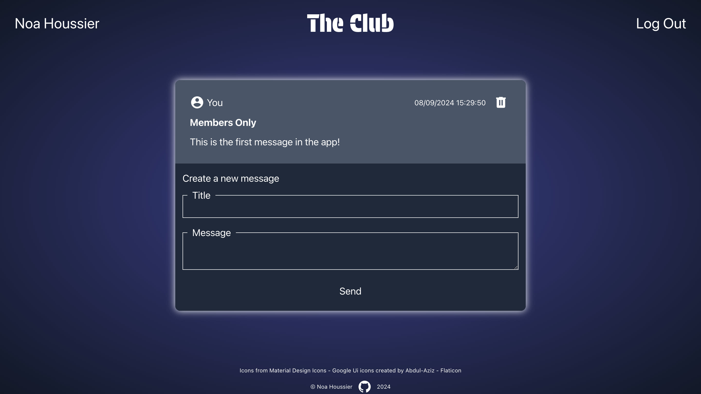

<a id="top"></a>

<div align="center">
    <a href="https://github.com/NestorNebula/members-only">
        
    </a>
    
<h3>Members Only</h3>
</div>

## Description



This project is an "exclusive clubhouse" where users can or can't see/write/delete messages based on authentication and permissions.

When a user lands on the website for the first time, he can see the club's messages but cannot see who posted them or post a message himself.

Once the user create an account, he will be able to send messages to the club.

To see the messages authors, the user must become a member by entering a secret password. The user can also become an admin by entering another secret password, which gives him the right to delete messages.

### Built With

[](https://nodejs.org/)
[](https://expressjs.com/)
[](https://www.postgresql.org/)

#### AND


[](https://www.passportjs.org/)


## Getting Started

### Prerequisites

- NPM
- NodeJS
- PostgreSQL

### Installation

1. Fork the repository
2. Clone the forked repository to your local machine
   ```
   git clone git@github.com:<your username>/<repo name>.git
   ```
3. Update remote URL

   ```
   # SSH:
   git remote add upstream git@github.com:members-only/<repo name>.git

   # HTTPS:
   git remote add upstream https://github.com/members-only/<repo name>.git
   ```

4. Install required packages
   ```
   npm install
   ```
5. Create a postgreSQL database
6. Create a .env file in the project root directory with the following keys
   ```
   PORT=8080
   LOCAL_DB="postgresql://<role_name>:<role_password>@localhost:5432/<your_db_name>"
   SESSION_SECRET=<secret>
   CLUB_PASSWORD=<password>
   ADMIN=<password>
   ```
7. Update the following files.

   ```
   # Files: ./db/populatedb.js and ./db/pool.js

   Replace process.env.PRODUCTION_DB by process.env.LOCAL_DB
   ```

8. Run the following commands in your terminal.

   ```
   node ./db/populatedb.js

   psql <your_db_name> < node_modules/connect-pg-simple/table.sql
   ```

9. Open the app
   ```
   node --watch app.js
   ```

If an error occurs, make sure you have done everything properly according to this guide. If you think so, you can <a href="https://github.com/NestorNebula/members-only/issues">Open an Issue</a>.

## Usage

After opening the app, you can create an account by clicking on "Sign-Up " and submitting the form. Then, you should be redirected to the log-in page.

Once you are logged in, you should be able to send messages by submitting the form in the homepage.

If you are running this project locally, you can have more possibilites by becoming a member and an admin. Just submit the secrets passwords you have set in your .env file.

## Contributing

If you find an issue within the app, you can <a href="https://github.com/NestorNebula/inventory-application/issues">Open an Issue</a>.

## License

[](https://github.com/NestorNebula/members-only/blob/main/LICENSE)

## Contact

Noa Houssier - [Github](https://github.com/NestorNebula)

## Acknoledgements

- [Node Postgres](https://github.com/brianc/node-postgres)
- [Express Validator](https://express-validator.github.io/)
- [Material Design Icons](https://pictogrammers.com/library/mdi/)
- [Connect PG Simple](https://www.npmjs.com/package/connect-pg-simple)
- [Connect Flash](https://www.npmjs.com/package/connect-flash)

<p align='right'>(<a href='#top'>go back to the top</a>)</p>
